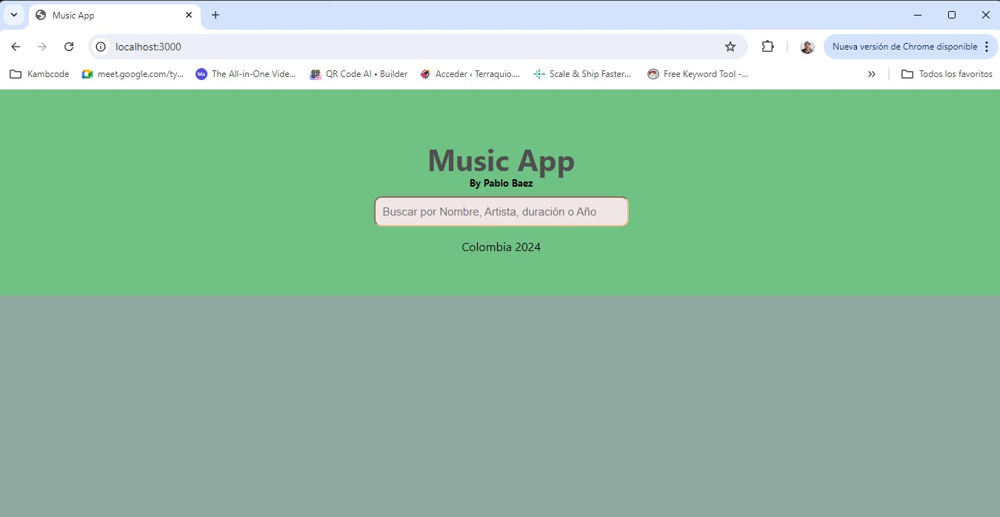
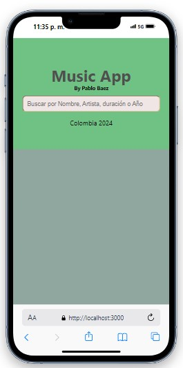
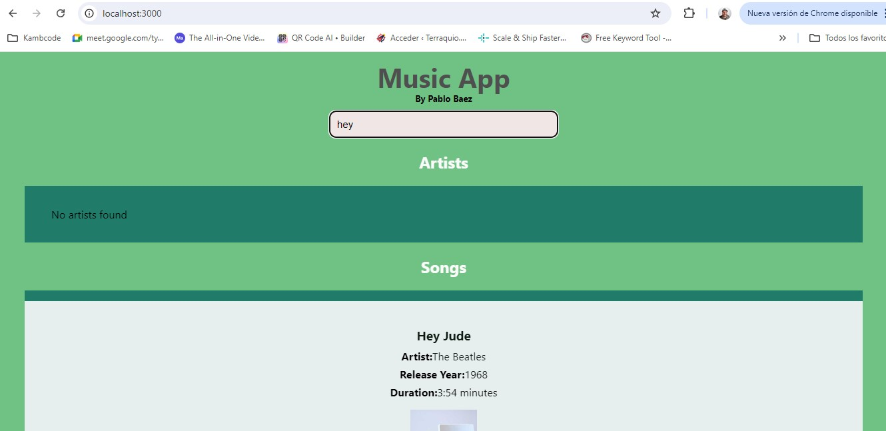
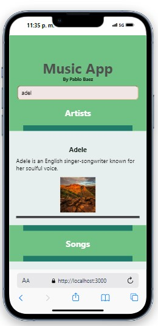
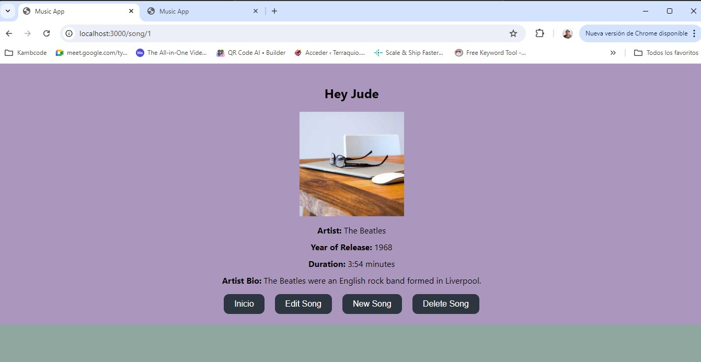
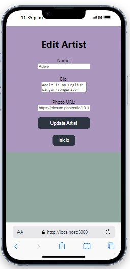

# MUSIC APP

Este proyecto de Frontend  esta desarrollado en REACT JS, diseño responsivo, corre en la siguiente URL:
Open [http://localhost:3000](http://localhost:3000) click para ver en el navegador.

# Dependencias Necesarias para su funcionamiento

 "dependencies":
    - "@babel/plugin-proposal-private-property-in-object": "^7.21.11",
    - "@testing-library/jest-dom": "^5.17.0",
    - "@testing-library/react": "^13.4.0",
    - "@testing-library/user-event": "^13.5.0",
    - "axios": "^1.7.4",
    - "react": "^18.3.1",
    - "react-dom": "^18.3.1",
    - "react-router-dom": "^6.26.1",
    - "react-scripts": "5.0.1",
    - "web-vitals": "^2.1.4"

# Descripción
Es una biblioteca de Musica 'MUSIC APP' que permite buscar canciones, artirstas y realizar metodos CRUD impactando una base de datos PostgresSQL.

# Imagenes
- Home PC

- Home Mobile

- Busqueda por Artista, Cancion, duracion, etc.

- Puedes ver artistas y canciones, editar su información, crear nueva infromación y eliminarla.

